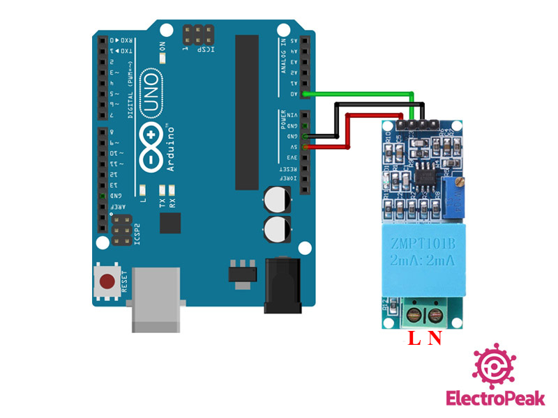
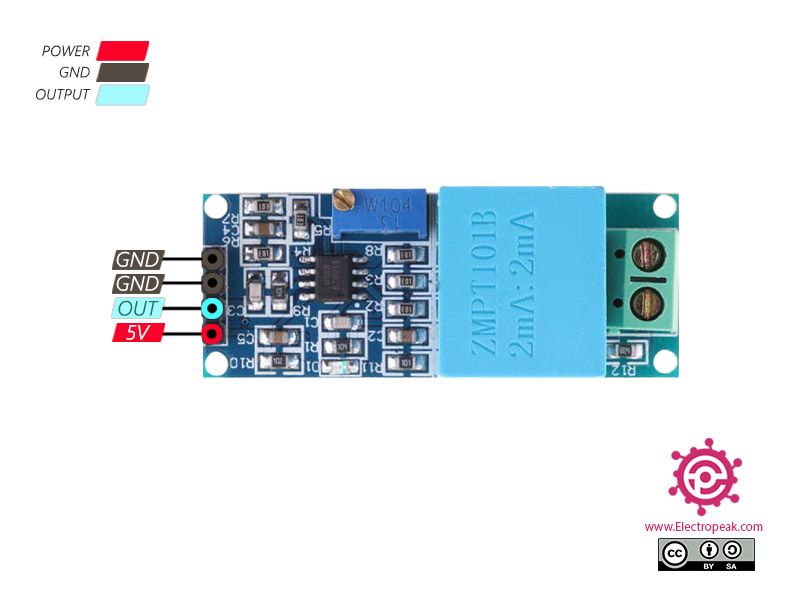

# HC-LIB
## Arduino ZMPT101B Library v1.0.2203
This __library__ contains ZMPT101B sensor definitions and True RMS/RMS readers.

### Dependencies
- HC-LIB.System v1.0.2203
- HC-LIB.IO     v1.0.2203
- HC-LIB.Device.Abstractions     v1.0.2111

### Features
- Defines error type and constants for ZMPT101B sensor.
- Implemented True RMS/RMS readers for reading voltage from the ZMPT101B sensor.

### Usage
1. Connect __ZMPT101B__ sensor to __Arduino__ board according the schema (see below). The ZMPT101B sensor can be connected to any _analog_ port.


2. Create a sketch and upload it to Arduino. Sketch should contain the following sections:
    - ZMPT101B sensor initialization code in the `setup()` method.
    ```c++
    IPortAdapter<int> *adapter = (IPortAdapter<int>*)new AnalogPortAdapter(ZMPT101B_PIN);
    IStream<uint16_t> *stream = (IStream<uint16_t> *)new AnalogStream(adapter);

    sensor = new ZMPT101BSensor(ZMPT101B_PIN, stream);
    ```
    - Initialize the corresponded reader for reading RMS or True RMS data from sensor:
        - for RMS:
        ```c++
        ZMPT101BRmsReader* rmsReader;
        ITimer *timer = (ITimer *)new ArduinoTimer();
        rmsReader = new ZMPT101BRmsReader(timer);
        ```
        - or for True RMS:
        ```c++
        ZMPT101BTrueRmsReader* trueRmsReader;
        ITimer *timer = (ITimer *)new ArduinoTimer();
        trueRmsReader = new ZMPT101BTrueRmsReader(timer);
        ```
    - Read data from the sensor by using:
        - RMS reader
        ```c++
        ZMPT101B_ACVoltage sensorData1 = rmsReader->read(sensor);
        ```
        - or True RMS reader
        ```c++
        ZMPT101B_ACVoltage sensorData2 = trueRmsReader->read(sensor);
        ```

### Sample
The __sample application__ is stored in __sample__ folder. 
The `pio run -e nanonew -t upload` command is used for compiling and upload the __sample application__.

See the included examples and tests for further usage examples.

### Unit tests
The `pio test -e {environment}` command is used for running unit tests on the specified {environment}. See https://docs.platformio.org/en/latest/plus/unit-testing.html for more details

### Packages
* The `pio package pack -o {local_repo_folder}` command is used for creating PlatformIO package.
* The `pio package publish {local_repo_folder}/HC-LIB.ZMPT101B-1.0.2111.tar.gz` command is used for publishing PlatformIO package.

* The `nuget.exe pack HC-LIB.ZMPT101B.nuspec -outputdirectory {local_repo}` command is used for creating NuGet package and store it in the {local_repo} folder.
* The `nuget.exe install HC-LIB.ZMPT101B` command is used for installing NuGet package.

### Changelog
See [CHANGELOG.md](CHANGELOG.md)

### License
See [LICENSE.md](LICENSE.md)