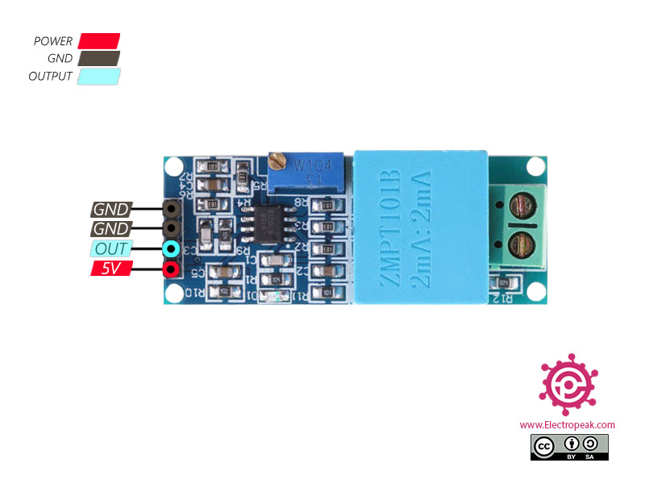

# HC-LIB
## Arduino ZMPT101B Library v1.0.2609
This __library__ defines __ZMPT101BSensor__ and RMS / True RMS readers for the ZMPT101B AC voltage module.

The PlatformIO project is the library root (`platformio.ini`, `src/`, `test/`).

### Dependencies
- HC-LIB.Devices v1.1.2609

### Features
- Defines __ZMPT101BSensor__ as an __AnalogSensor__ on an analog pin, with a calibrated ADC __zero__.
- __ZMPT101B::calibrate__ averages samples into that zero.
- __ZMPT101BRmsReader__ and __ZMPT101BTrueRmsReader__ return __Expected{ZMPT101B_ACVoltage, Error}__.
- Errors are __DeviceError::TimerIsNotInitialized__ and __IoError::StreamNotCreated__.

### Usage
1. Connect __ZMPT101B__ to an analog pin (see __How to connect device to Arduino board__).
2. Create a sketch. It should contain the following sections:
    - ZMPT101B sensor initialization in `setup()`:
    ```c++
    IPortAdapter<int> *adapter = new AnalogPortAdapter(ZMPT101B_PIN);
    IStream<uint16_t> *stream = new AnalogStream(adapter);
    ZMPT101BSensor *sensor = new ZMPT101BSensor(ZMPT101B_PIN, stream);
    ZMPT101B::calibrate(sensor);
    ```
    - Initialize the corresponding reader for RMS or True RMS:
        - for RMS:
        ```c++
        ITimer *timer = new ArduinoTimer();
        ZMPT101BRmsReader *rmsReader = new ZMPT101BRmsReader(timer);
        ```
        - or for True RMS:
        ```c++
        ITimer *timer = new ArduinoTimer();
        ZMPT101BTrueRmsReader *trueRmsReader = new ZMPT101BTrueRmsReader(timer);
        ```
    - Read data from the sensor:
        - RMS reader
        ```c++
        Expected<ZMPT101B_ACVoltage, Error> sensorData1 = rmsReader->read(*sensor);
        if (sensorData1.hasValue())
        {
            float volts = sensorData1.getValue().data;
        }
        else
        {
            Error error = sensorData1.getError();
        }
        ```
        - or True RMS reader
        ```c++
        Expected<ZMPT101B_ACVoltage, Error> sensorData2 = trueRmsReader->read(*sensor);
        if (sensorData2.hasValue())
        {
            float volts = sensorData2.getValue().data;
        }
        else
        {
            Error error = sensorData2.getError();
        }
        ```

### Device purpose
The __ZMPT101B__ is an isolated single-phase AC voltage sensor. A 2 mA : 2 mA voltage transformer and an onboard op-amp turn mains voltage into a 0–5 V analog waveform centered near mid-scale. The Arduino ADC samples that waveform; this library converts the samples to RMS or True RMS volts.

Use it for energy monitors, under/over-voltage detection, and other sketches that need a safe, isolated AC voltage reading.

### Device characteristics
Values below are typical for the common ZMPT101B breakout (confirm the marking on your board).

| Item | Typical value |
|---|---|
| Supply | 5 V DC |
| Transformer | ZMPT101B, 2 mA : 2 mA |
| Analog out | ~0–5 V, mid-point ~2.5 V (ADC ~512 at 10-bit) |
| AC input | screw terminals L / N (mains, isolated from the MCU) |
| Gain | onboard multi-turn potentiometer |
| Network frequency | 50 Hz (`AC_NETWORK_FREQUENCY`) |
| Sample window | two AC periods (40 ms at 50 Hz) |

Calibrate with no AC (or a known idle waveform) so __zero__ tracks the module mid-point. The onboard trimmer sets gain; the example's polynomial maps ADC offset from zero to volts.

### How to connect device to Arduino board
The example uses a ZMPT101B module on an Arduino Nano (ATmega328, new bootloader). Control-side wiring:

| Module pin | Arduino Nano | Role |
|---|---|---|
| 5V / VCC | 5V | Module supply |
| GND | GND | Common ground |
| OUT | A0 | Analog sample (`ZMPT101B_PIN` in the example) |

AC side (screw terminals, isolated from the MCU):

| Terminal | Role |
|---|---|
| L | Line of the voltage under test |
| N | Neutral of the voltage under test |




Mains on L/N is hazardous. Keep that wiring away from the Nano. Fuse the measured circuit and do not touch the screw terminals while they are live.

1. Wire 5V, GND, and OUT as in the table. Leave L/N disconnected until the analog output looks mid-scale on A0.
2. Adjust the trimmer so a known AC voltage matches the printed RMS (optional).
3. Upload __examples/ZMPT101BExampleApp__ (`pio run -e nano-board -t upload`). Serial is `115200` on `COM3`.
4. The sketch calibrates, then prints `220V`, RMS, and True RMS every 500 ms.

To use another analog pin, change `ZMPT101B_PIN` and move the OUT wire to that pin.

### Environments
Run commands from this folder (`ZMPT101B-lib`).

| Environment | Platform | Purpose |
|---|---|---|
| `nano-board` | Arduino Nano (ATmega328, new bootloader) | Firmware: `setup()` / `loop()` from __test/tests_runner.cpp__ |
| `desktop` | native | Unity tests |
| `desktop-debug` | native | Unity tests with debug symbols (`-O0 -ggdb3`). Default. |

__test/tests_runner.cpp__ is the single entry point: a firmware stub when `UNIT_TEST` is off, and the Unity runner when it is on.

### Build
```powershell
pio run -e nano-board
pio run -e nano-board -t upload
pio run -e desktop-debug
```

Firmware is written to `.pio/build/nano-board/firmware.hex`. Default serial settings are `115200` baud on `COM3`.

### Unit tests
```powershell
pio test -e desktop-debug
```

Use `-e desktop` for a non-debug native run, or `-e nano-board` to run tests on the board. See https://docs.platformio.org/en/latest/plus/unit-testing.html for more details.

### Sample
The voltage demo is in the __examples/ZMPT101BExampleApp__ folder. From that folder:
```powershell
pio run -e nano-board -t upload
```

### Packages
Arduino Library Manager metadata is in [library.properties](library.properties). PlatformIO metadata is in [library.json](library.json).

* The `pio package pack -o {local_repo_folder}` command is used for creating PlatformIO package `HC-LIB.ZMPT101B-{version}.tar.gz` in the `{local_repo_folder}` folder.
* The `pio package publish {local_repo_folder}/HC-LIB.ZMPT101B-{version}.tar.gz` command is used for publishing PlatformIO package.

* The `nuget.exe pack HC-LIB.ZMPT101B.nuspec -outputdirectory {local_repo_folder}` command is used for creating NuGet package and store it in the `{local_repo_folder}` folder.
* The `nuget.exe install HC-LIB.ZMPT101B` command is used for installing NuGet package.

### Changelog
See [CHANGELOG.md](CHANGELOG.md)

### License
See [LICENSE.md](LICENSE.md)
